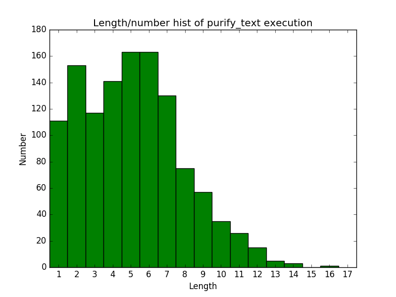
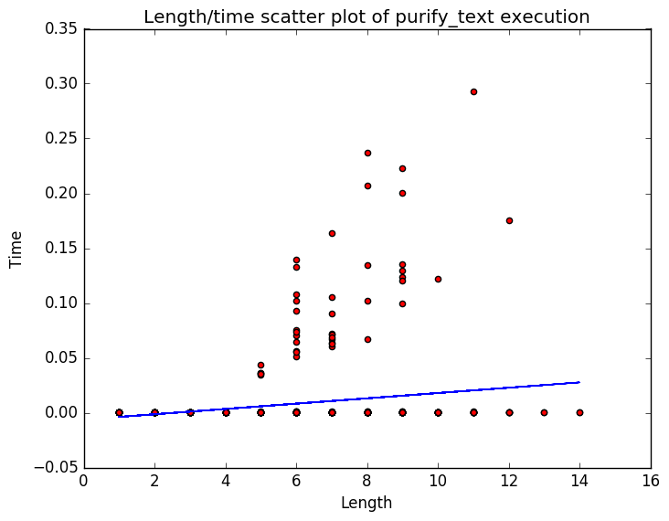

empty
=======
#term4 au project

Список задач (27.04.16):

* ~~Нахождение и выделение нецензурной лексики, наиболее быстрый алгоритм~~
* ~~Тесты~~
* ~~Профиллирование работы~~
* Приведение кода в лицеприятное состояние

Сейчас (27.04.16):

* Идея с mystem провалилась: слишком медленно
* Скрыть commit'ы словарей матов и тестов (какое-нибудь простое кодирование?)

###Информация о выборке
 <br />
Реальный пример текста:
```
всем пака с вами был данил 92 жди 12 части
рости шамбарова да жалуйся в групе я тебя не баюсь да пашол ты в ростик шамбарова
я тебя не баюсь я не буду руский учит зазазазазазазазаз
ростик шамбарова меня не жэляют это тебя жэлеют тваи видео
дажэ я тебя пажэлел ты лох и не саревнуйся са мной у меня большэ лайков
```

###Результаты
 <br />


***

Текущая скорость распознавания: **~6100-8000** слов в секунду на реальных данных (хорошо?) <br />
Текущая точность распознавания: **100%** (плохие тесты, мало матов, много ошибок)


